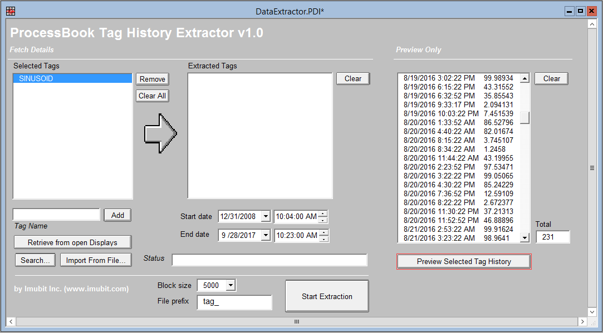

# This tool is obsolete and is no longer supported

Please use Data Extractor instead - https://github.com/imubit/qt-data-extractor

# PI ProcessBook Tag Data Extractor

This tool can be used to extract extensive tag history from PI Server using ProcessBook only. The data can saved in CSV files (one file per tag).

The tool is implemented as VB script only

## Usage

* Open PDI in your ProcessBook
* Select tags you are willing to extract. Tags can be selected in one of the following ways:
 * Searching tags with standard ProcessBook searching tool (click Search...)
 * Importing text file with a single tag name per line
 * Adding tag names manually (default server will be assumed, if not server path is provided (full path "\\SERVNAME\tagname", default server - "tagname")
 * Retrieving tags from open displays of active ProcessBook file (*.PIW). To use this option make sure only 1 PIW file is open with at least a single Display is viewed.
* Select time period you are interested in
* Click Extract

* CSV file per each tag will be created within Save Directory (you can modify the default path)

### Other options

* You can change "Block size" value if you run low on memory, or PI Server is limited on how much data can be fetched per transaction (this value is an amount of tag samples extracted in a single iteration)
* Sometimes it is conventient to change file prefix - "tag_", (i.e. while 2 tags have the same name) before clicking on "Extract"
* Tag content can be previewed before extraction (e.g. for making sure it is not empty), by selecting tag name within tags list and clicking on "Preview Selected Tag History"
* It is now possible to add new value to selected tag - make sure at least one tag is added to the tags list and select relevant tag from the list before adding a value

## Screenshots

## License

Licensed under the Apache License, Version 2.0 (the "License"); you may not use this file except in compliance with the License. You may obtain a copy of the License at

http://www.apache.org/licenses/LICENSE-2.0

Unless required by applicable law or agreed to in writing, software distributed under the License is distributed on an "AS IS" BASIS, WITHOUT WARRANTIES OR CONDITIONS OF ANY KIND, either express or implied. See the License for the specific language governing permissions and limitations under the License.

-- Meir Tseitlin, Imubit
